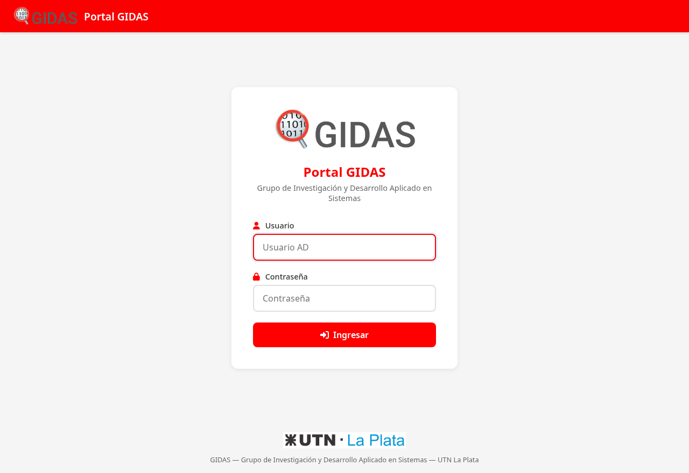
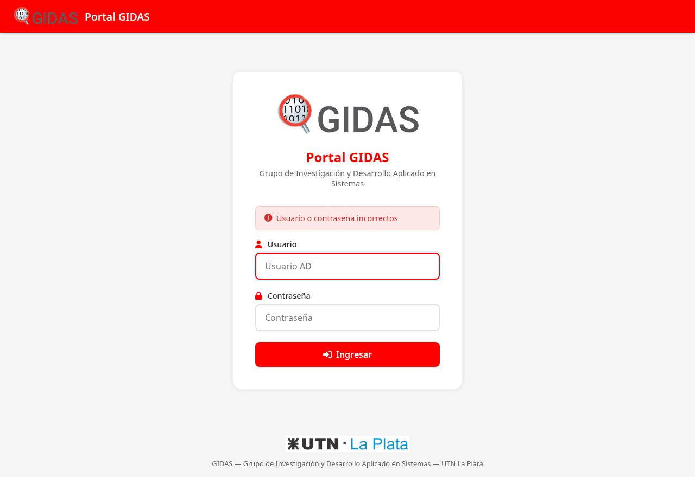
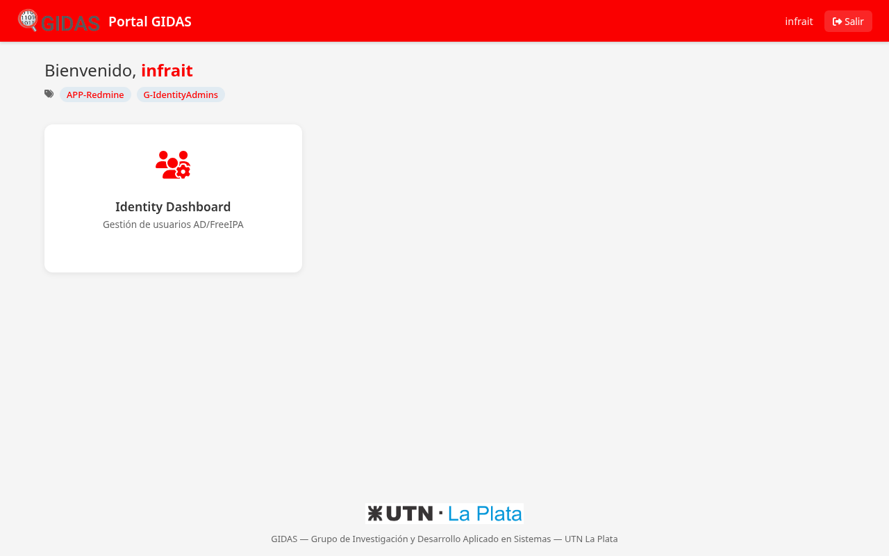

# Guía de Usuario — Portal GIDAS

> **URL**: `http://portal.gidas.local` (LAN) o `http://192.168.1.43`
> **Última actualización**: 2026-07-02

---

## 1. ¿Qué es el Portal GIDAS?

El Portal GIDAS es el punto de acceso único a todas las herramientas del grupo. Con tu usuario y contraseña de AD GIDAS podés ver y acceder a las herramientas que corresponden a tu perfil.

No necesitás recordar múltiples URLs ni contraseñas — usás la misma credencial que usás para iniciar sesión en tu PC.

---

## 2. Acceder al Portal

Abrí tu navegador y entrá a:

```
http://portal.gidas.local
```

> **Nota**: Si estás fuera de la red GIDAS, necesitás conectarte via Twingate primero.

Verás la pantalla de inicio de sesión:



---

## 3. Iniciar Sesión

1. Ingresá tu **Usuario** (el mismo que usás para iniciar sesión en tu PC, sin `@gdc01.local`)
2. Ingresá tu **Contraseña** de AD
3. Hacé clic en **Ingresar**

Si los datos son correctos, entrarás al dashboard.

---

## 4. Si Olvidaste tu Contraseña

Tu contraseña es la misma de AD GIDAS. Si la olvidaste, contactá al administrador del sistema para restablecerla.

---

## 5. Errores Comunes

### "Usuario o contraseña incorrectos"



Posibles causas:
- Escribiste mal el usuario o la contraseña
- Tu cuenta está deshabilitada en AD
- Cambiaste la contraseña recientemente y estás usando la anterior

### "Servicio de autenticación no disponible"

- El servidor AD está temporalmente fuera de servicio
- Esperá unos minutos e intentá de nuevo
- Si persiste, contactá al administrador

---

## 6. El Dashboard

Una vez autenticado, ves tu dashboard personalizado con las herramientas que podés usar:



Cada herramienta se muestra como una **tarjeta (card)** con:
- **Ícono** representativo de la herramienta
- **Nombre** de la herramienta
- **Descripción** breve de su función
- Al hacer clic, se abre la herramienta en una nueva pestaña

### ¿Por qué veo ciertas herramientas y otras no?

El portal muestra **solamente las herramientas que corresponden a tus grupos AD**. Por ejemplo:

| Si pertenecés al grupo... | Podés ver... |
|--------------------------|-------------|
| **G-Direccion** | Todas las herramientas |
| **G-Coordinadores** | GitLab, Redmine, Grafana, Proxmox, NetBox, GLPI, MikroTik |
| **G-Becarios** | GitLab, Redmine, NetBox |
| **G-IdentityAdmins** | Identity Dashboard |

Si no ves ninguna herramienta, contactá al administrador para verificar tus grupos AD.

---

## 7. Cerrar Sesión

Hacé clic en **Salir** (arriba a la derecha) para cerrar tu sesión. La sesión también expira automáticamente después de 8 horas de inactividad.

---

## 8. Herramientas Disponibles

| Herramienta | URL | ¿Qué hace? |
|------------|-----|-----------|
| **GitLab** | https://gitlab.gidas.local | Repositorios de código, CI/CD |
| **Redmine** | https://redmine.gidas.local | Gestión de proyectos |
| **Grafana** | http://192.168.1.205:3000 | Monitoreo y métricas |
| **Proxmox VE** | https://192.168.1.14:8006 | Hipervisor |
| **NetBox** | http://netbox.gidas.local | CMDB - Inventario |
| **GLPI** | http://glpi.gidas.local | ITSM - Mesa de ayuda |
| **MikroTik** | http://192.168.1.1 | Router y firewall |
| **Identity Dashboard** | Ver en GitLab | Gestión de usuarios AD/FreeIPA |

Cada herramienta te pedirá que inicies sesión con tu usuario y contraseña de AD (la misma del portal).

---

## 9. Preguntas Frecuentes

### ¿El portal guarda mi contraseña?
No. Tu contraseña solo se usa para verificar tu identidad contra el AD en el momento del login. Nunca se almacena.

### ¿Puedo acceder desde casa?
Sí, si tenés **Twingate** instalado y conectado. Consultá con el administrador si necesitás acceso remoto.

### ¿Cada cuánto tengo que volver a iniciar sesión?
La sesión dura 8 horas. Después de ese tiempo, el portal te pedirá que ingreses de nuevo.

### ¿Puedo cambiar mi contraseña desde el portal?
No. El cambio de contraseña se gestiona en AD. Consultá con el administrador.
